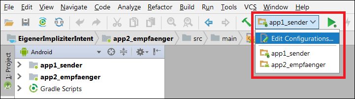
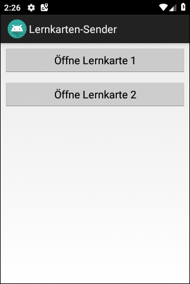
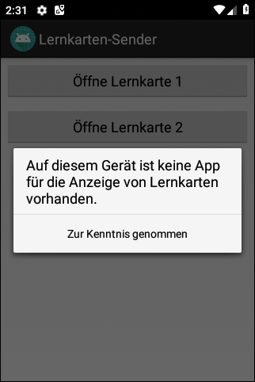
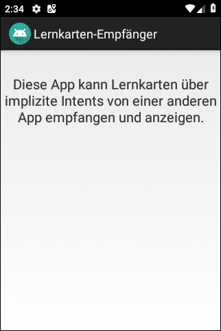
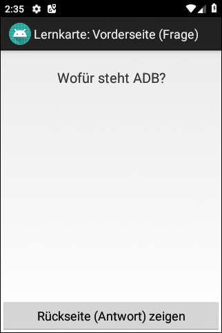
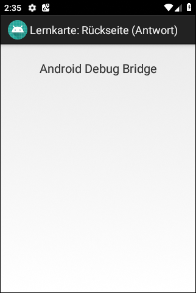

# Android-App "Eigener Intent" #

 

Two apps demonstrating how to use a **custom implicit intent** to send data (learning cards) from one app to another app.

 

This Android Studio project contains two apps modules:

* `app1_sender`: App sending a learning card using a custom implicit intent.

* `app2_empfaenger`: App for displaying a learning card received via implicit intent.

 

 

 

Identifiers (names for classes, variables and methods), UI text and (JavaDoc) comments are in German only.

 

----

## Screenshots from app 1 (Sender of learning card) ##

 

 &nbsp;  

 

----

## Screenshots from app 2 (Receiver of learning card) ##

 

 &nbsp; 

 

----
## License #

 

See the [LICENSE file](LICENSE.md) for license rights and limitations (BSD 3-Clause License).

 
